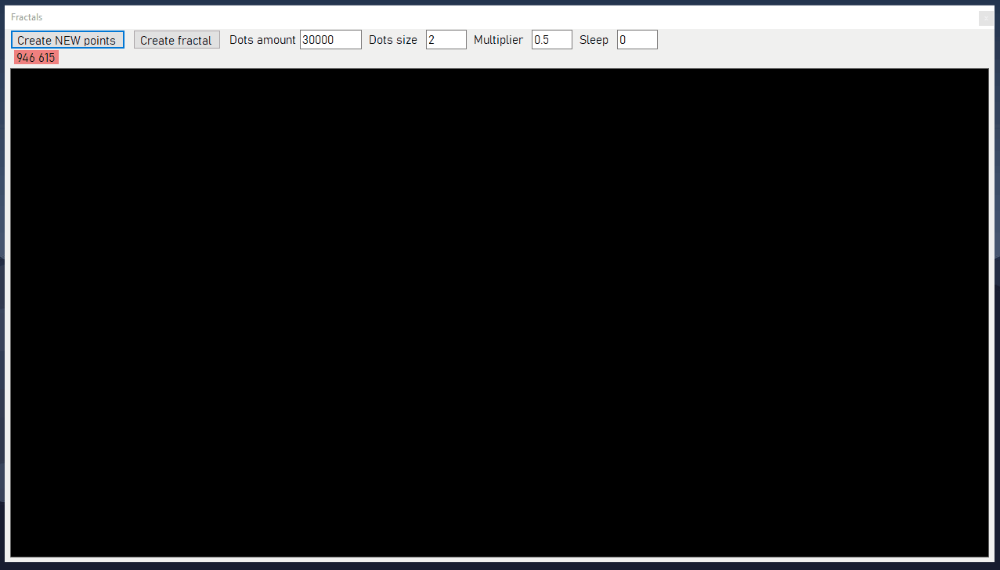

WinForms "Fractal" Creator
===

what it is
---

it's my old student funny project (i'm still student in 2020), i placed it here just as a keepsake :)



How to
---
* Click Create New Points
* Create 3 (or more) points by clicking on black canvas
* Click Finish
* Click Create Fractal

P.S.
===

```c++
#define ever (;;)

word main(){

	for ever{
		feel_free_to_correct_me_in (english, code, anything);
	}

	return thank_you;
}
```